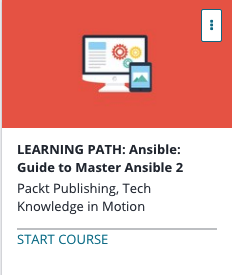

```
Roberto Nogueira  
BSd EE, MSd CE
Solution Integrator Experienced - Certified by Ericsson
```
# Udemy Learning Path: Ansible



**About **

Learn everything you need to about the subject of this `Udemy` project.

[Homepage](https://www.udemy.com/learning-path-ansible-guide-to-master-ansible-2/learn/v4/content)

## Topics
```
Section: 1
0 / 34
Ansible 2 for Beginners
[ ] 1. The Course Overview 4:25
[ ] 2. What Is Ansible? 3:29
[ ] 3. Why Ansible? 3:09
[ ] 4. Demonstration – From Bash to Ansible 19:28
[ ] 5. Course Layout 2:54
[ ] 6. Basic Ansible Vocabulary 2:53
[ ] 7. New Features in Ansible 2.0 3:30
[ ] 8. Creating an Ansible Home Base 3:02
[ ] 9. Installing Ansible 5:48
[ ] 10. Bleeding-Edge Ansible Installation 8:30
[ ] 11. Setting up our Test Environment 7:33
[ ] 12. Target Machine Requirements 3:07
[ ] 13. Ansible Configuration Hierarchy 5:16
[ ] 14. Ansible Hosts Inventory File 5:19
[ ] 15. Ad-Hoc Commands 7:54
[ ] 16. Introduction top playbooks 19:40
[ ] 17. Playbook Structure 11:16
[ ] 18. Introduction to Modules 6:01
[ ] 19. Common Modules 11:29
[ ] 20. Variables and Facts 17:55
[ ] 21. Real-Life Playbook: Mattermost Deployment 12:02
[ ] 22. Real-Life Playbook Walkthrough 14:43
[ ] 23. Debugging and Troubleshooting 13:06
[ ] 24. Conditionals and Control Flow 4:52
[ ] 25. Templating, Control Flow, and Iteration in Jinja2 7:37
[ ] 26. YAML Basics 4:37
[ ] 27. Ansible Blocks 3:59
[ ] 28. Performance and Execution Strategies 8:10
[ ] 29. Ansible Galaxy 4:58
[ ] 30. Security 4:13
[ ] 31. Ansible in the Cloud 3:01
[ ] 32. Ansible AWS Demo 25:10
[ ] 33. Ansible Tower 2:30
[ ] Quiz 1: Test your Knowledge 0:00

Section: 2
0 / 36
Mastering Ansible
[ ] 34. The Course Overview 4:10
[ ] 35. Ansible Requirements – Python, PIP, and Virtual Environments 9:46
[ ] 36. Ansible Course Environment Setup 26:59
[ ] 37. Ansible on Microsoft Windows 13:41
[ ] 38. Ansible on Mac OS X 6:03
[ ] 39. Ansible on Linux 18:12
[ ] 40. Validating Ansible Installation 27:13
[ ] 41. Ansible Inventories 30:01
[ ] 42. Ansible Modules 23:32
[ ] 43. YAML 30:16
[ ] 44. Ansible Playbooks, Breakdown of Sections 27:17
[ ] 45. Ansible Playbooks, Variables 31:26
[ ] 46. Ansible Playbooks, Facts 28:03
[ ] 47. Templating with Jinja2 34:26
[ ] 48. Ansible Playbooks, Creating, and Executing 30:57
[ ] 49. Ansible Playbook Modules 21:32
[ ] 50. Dynamic Inventories 22:37
[ ] 51. register and when 21:23
[ ] 52. Looping 33:28
[ ] 53. Asynchronous and Parallel 28:38
[ ] 54. Task Delegation 16:53
[ ] 55. Magic Variables 10:08
[ ] 56. Blocks 5:34
[ ] 57. Using the Ansible Vault 20:23
[ ] 58. Creating Custom Modules 31:45
[ ] 59. Creating Plugins 13:11
[ ] 60. Using Includes and Imports 16:58
[ ] 61. Using Tags 9:44
[ ] 62. Using Roles 15:48
[ ] 63. AWS with Ansible 26:00
[ ] 64. Docker Support with Ansible 18:44
[ ] 65. Troubleshooting Ansible 12:18
[ ] 66. Validating Testing with Ansible 4:10
[ ] 67. Best Practices with Ansible 5:12
[ ] 68. Upgrading Ansible 11:47
[ ] Quiz 2: Test your Knowledge 0:00
```
